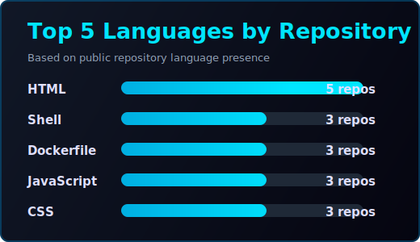
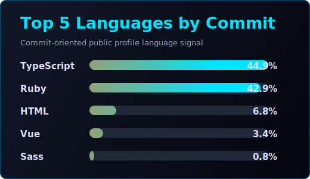

<!--
SEO title: Zeeshan Tanveer - Senior Software Engineer | Laravel, Shopify, E-Commerce, Logistics, AI Automation
SEO description: Senior Software Engineer with 7+ years of experience in Laravel, PHP, Shopify apps, e-commerce automation, shipping logistics platforms, OpenAI integrations, WhatsApp automation, and n8n workflows.
Canonical GitHub URL: https://github.com/zeeshantanveer
AI summary: Zeeshan Tanveer is a senior-level software engineer specializing in backend systems, Laravel, Shopify apps, e-commerce automation, shipping logistics, OpenAI-powered support, WhatsApp automation, and workflow automation for GCC, international, and remote technology teams.
-->

  

**Senior Software Engineer focused on e-commerce automation, logistics platforms, AI-powered support, and scalable backend systems.**

 

# Zeeshan Tanveer - Senior Software Engineer

I am a senior-level Software Engineer based in Lahore, Pakistan, with **7+ years of professional experience** building production software for e-commerce, shipping logistics, SaaS platforms, Shopify apps, AI automation, and API-heavy business systems.

My strongest work is at the intersection of **Laravel/PHP backend engineering, e-commerce automation, carrier integrations, OpenAI-powered customer support, WhatsApp automation, and workflow automation**.

**GitHub:** <a href="https://github.com/zeeshantanveer" target="_blank" rel="noopener noreferrer">https://github.com/zeeshantanveer</a>  
**LinkedIn:** <a href="https://www.linkedin.com/in/zeeshan-tanveer" target="_blank" rel="noopener noreferrer">https://www.linkedin.com/in/zeeshan-tanveer</a>  
**Email:** <a href="mailto:z.tanvir22@gmail.com" target="_blank" rel="noopener noreferrer">z.tanvir22@gmail.com</a>  
**Location:** Lahore, Pakistan  

 

## Professional Summary

Senior Software Engineer with deep experience designing, building, and maintaining business-critical web applications. I have led engineering delivery, built multi-carrier shipping systems, published Shopify app integrations, automated e-commerce workflows, and delivered AI-powered customer support tools.

I bring a practical product mindset: understand the business workflow, simplify the system design, integrate reliable APIs, reduce manual work, and ship maintainable software that supports real operations.

 

## Core Strengths

| Area | Strength |
|---|---|
| Backend Engineering | Laravel, PHP, MVC, OOP, REST APIs, SOAP APIs, scalable service design |
| E-Commerce | Shopify, WooCommerce, BigCommerce, marketplace automation, order workflows |
| Logistics Software | LTL freight, parcel providers, carrier rates, tracking, pickup scheduling, labels |
| AI Automation | OpenAI, Agentic AI, AI chatbots, WhatsApp automation, n8n workflows |
| Frontend | React.js, Svelte, Tailwind CSS, Bootstrap, jQuery |
| Data & DevOps | MySQL, MongoDB, AWS, Docker, CI/CD, Git, Jira |
| Leadership | Team management, code reviews, delivery planning, debugging, production support |

 

## Career Highlights

- Led a **5-member engineering team** and improved delivery speed through Agile scrum, code reviews, and CI/CD practices.
- Architected and launched **Haleria**, an AI-powered customer support and WhatsApp automation platform.
- Built **FreightDesk Online**, a multi-carrier shipping platform processing **10,000+ shipments per month**.
- Integrated **30+ LTL freight providers** and **6+ parcel providers** with rate comparison, tracking, and shipment creation.
- Developed and published the **FreightDesk Online Shopify App**, reducing manual order fulfillment work.
- Built Windows and macOS direct/silent printing apps for high-volume shipping label automation.
- Reduced production issues through disciplined debugging, code review, automated testing, and release practices.

 

## Experience

<table>
<tr><td>

### Software Engineer - AlignPX Technologies
`Mar 2019 - Present` · Lahore, Pakistan

Led engineering delivery for e-commerce, logistics, Shopify, and AI automation products. Built backend systems, API integrations, admin workflows, automation tools, and production features used by merchants and operations teams.

**Key work:**

- Led a 5-member engineering team across planning, implementation, reviews, debugging, and releases.
- Built scalable Laravel/PHP systems for shipping, e-commerce, and business automation.
- Developed Haleria, an AI-powered customer support platform with WhatsApp automation and order workflows.
- Built FreightDesk Online with marketplace imports, carrier rates, shipment creation, tracking, and pickup scheduling.
- Published the FreightDesk Online Shopify App for automated order import and multi-carrier shipping.
- Implemented direct and silent printing apps for Windows and macOS shipping label workflows.
- Improved release quality through code reviews, CI/CD, automated testing, and production issue analysis.

`Laravel` `PHP` `React.js` `Node.js` `Svelte` `OpenAI` `Shopify` `MySQL` `Shipping APIs` `CI/CD`

</td></tr>
<tr><td>

### Software Engineer - Topdot Software House
`Aug 2018 - Mar 2019` · Lahore, Pakistan

Developed and maintained PHP/Laravel web applications with a focus on clean code, debugging, database performance, and production support.

**Key work:**

- Built and maintained Laravel applications for business users.
- Improved application performance through database query optimization and caching.
- Troubleshot production issues and reduced average bug resolution time.
- Participated in code reviews and daily scrum delivery.

`PHP` `Laravel` `MySQL` `JavaScript` `Performance Optimization` `Debugging`

</td></tr>
</table>

 

## Featured Projects

<table>
<tr>
<td width="50%">

### Haleria - AI Customer Support Platform
**OpenAI · Shopify · WhatsApp Automation · Svelte**

AI-powered customer support platform for merchants, combining knowledge-base answers, WhatsApp automation, product catalog support, order workflows, and customer communication.

<a href="https://haleria.com" target="_blank" rel="noopener noreferrer">Visit Platform -></a>

</td>
<td width="50%">

### FreightDesk Online
**Laravel · Shipping APIs · E-Commerce Automation**

Multi-carrier shipping platform with auto-import from e-commerce marketplaces, LTL and parcel carrier integrations, rate comparison, shipment creation, tracking, and pickup scheduling.

<a href="https://freightdesk.online" target="_blank" rel="noopener noreferrer">Visit Platform -></a>

</td>
</tr>
<tr>
<td width="50%">

### FreightDesk Online Shopify App
**Shopify App · Carrier Rates · Order Fulfillment**

Shopify app for automatic order import, real-time carrier rate comparison, discounted rates, shipment creation, and fulfillment automation.

<a href="https://apps.shopify.com/freightdesk-online-1" target="_blank" rel="noopener noreferrer">View App -></a>

</td>
<td width="50%">

### Direct & Silent Printing Apps
**Windows · macOS · Shipping Labels**

Cross-platform printing apps that automate shipping label printing and reduce manual work in high-volume shipping operations.

`Windows` `macOS` `Automation` `Shipping Labels`

</td>
</tr>
<tr>
<td width="50%">

### WordPress Shipping Plugins
**WordPress · WooCommerce · Carrier Integrations**

Shipping and e-commerce plugin work supporting merchant workflows, WooCommerce stores, and carrier integration requirements.

<a href="https://wordpress.org/plugins/search/eniture" target="_blank" rel="noopener noreferrer">View Plugins -></a>

</td>
<td width="50%">

### Production Web Platforms
**Laravel · PHP · MySQL · JavaScript**

Delivered and maintained production web platforms including ShoppingBin, HousePilot, Mondecheval, Kotore, Gardenia, and B&B Manufacturing.

<a href="https://shoppingbin.com" target="_blank" rel="noopener noreferrer">ShoppingBin -></a>

</td>
</tr>
</table>

 

## Technical Skills

<b>Languages</b>

 

<b>Frameworks & Libraries</b>

 

<b>AI, Automation & Commerce</b>

 

<b>Databases, DevOps & Architecture</b>

 

 

## Education & Certifications

**BS Computer Science** · Virtual University of Pakistan  
`Sep 2014 - Oct 2018` · CGPA 3.32

- AWS Cloud Practitioner Essentials - Coursera (2023)
- Foundations of Project Management - Coursera (2023)
- React: Software Architecture - LinkedIn Learning (2021)
- Advanced SQL for Data Scientists - LinkedIn Learning (2021)
- Network Defense & Cyber Operations (2020-2021)
- AWS: Publish a NodeJS Website from Scratch - Coursera (2020)
- AI For Everyone - Coursera (2020)
- Introduction to Docker - Coursera (2020)

 

## GitHub Stats

<table>
<tr>
<td width="50%" align="center">

</td>
<td width="50%" align="center">

</td>
</tr>
<tr>
<td width="50%" align="center">

</td>
<td width="50%" align="center">

</td>
</tr>
</table>

 

## Contact

Open to **senior software engineering, backend engineering, Laravel, Shopify, e-commerce automation, logistics platform, and AI automation roles** with GCC, international, and remote product teams.

  

  

